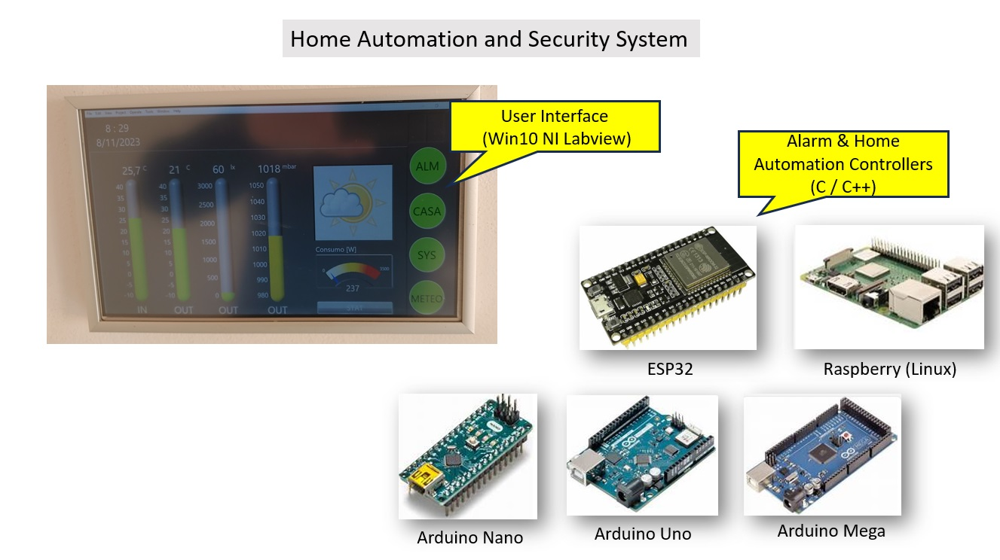
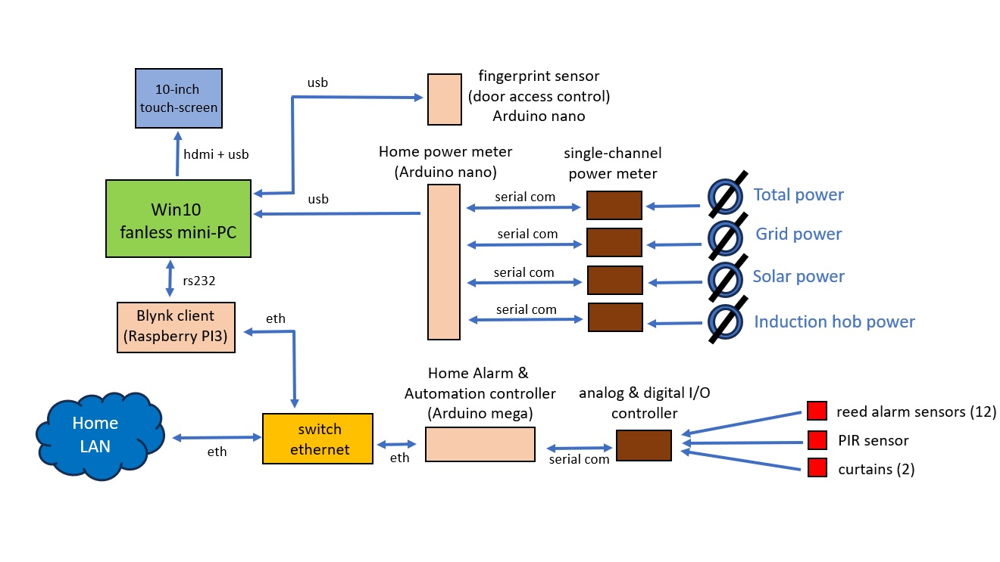
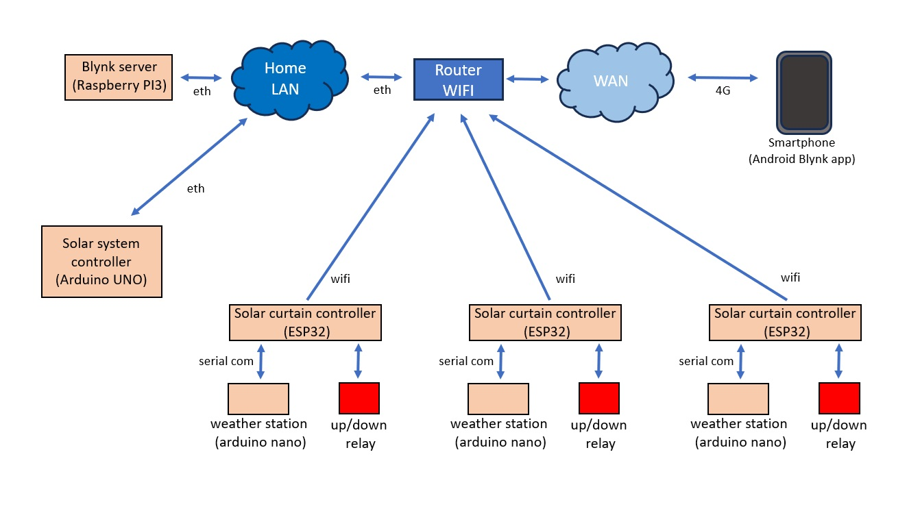

# 🏠 Home Automation & Security System

A fully custom-built, distributed home automation and security system designed and implemented from scratch by a senior embedded/automation engineer.

The system integrates multiple hardware platforms, communication protocols, and software environments into a unified architecture — covering energy monitoring, intrusion detection, access control, motorized curtains, and remote monitoring via smartphone.

---
## 📸 System Overview

## 🗺️ System Architecture

### Node & Sensor Architecture

### Network Architecture

---

## ⚙️ Hardware Platforms

| Platform | Role |
|---|---|
| **Win10 Fanless Mini-PC** | Central HMI and automation logic (LabVIEW) |
| **10" Touchscreen** | Dedicated local user interface |
| **Raspberry Pi 3** | Blynk server – always-on remote access gateway |
| **Arduino Mega** | Home alarm & automation controller (analog/digital I/O) |
| **Arduino Nano (x4)** | Power metering (4 channels) + fingerprint access controller + weather stations |
| **Arduino Uno** | Solar system controller |
| **ESP32 (x3)** | Solar curtain controllers – WiFi connected, one per window group |

---

## 🔌 Communication Protocols

- **Ethernet (ETH)** — backbone LAN between PC, Raspberry Pi, Arduino Mega, Ethernet switch
- **Serial (RS232 / UART)** — PC ↔ Blynk client, Arduino Nano ↔ power meters, ESP32 ↔ weather stations
- **USB** — PC ↔ fingerprint sensor, PC ↔ power meter hub
- **WiFi** — ESP32 curtain controllers ↔ home router
- **4G / WAN** — remote smartphone access via Android Blynk app
- **HDMI + USB** — PC ↔ touchscreen display

---

## 🔧 Features

### 🔐 Security & Access Control
- **Intrusion alarm system** with 12 reed contact sensors on doors/windows and 1 PIR motion sensor
- **Fingerprint reader** for physical door access control (Arduino Nano via USB)
- Alarm network **isolated on a dedicated private LAN** — separated from the general home network

### ⚡ Energy Monitoring
Real-time power monitoring on 4 independent channels via current clamp sensors:
- Total house consumption
- Grid power
- Solar PV production
- Induction hob power

### 🪟 Motorized Solar Curtains
- 3 independent ESP32 nodes, each controlling an up/down relay for motorized curtains
- Each node paired with a local **Arduino Nano weather station** for solar irradiance-based automation
- Fully remote controllable via smartphone

### 📱 Remote Access
- **Blynk server** running on Raspberry Pi 3 (always-on, local)
- **Android Blynk app** on smartphone — full remote control and monitoring over 4G/WAN
- No cloud dependency — self-hosted Blynk instance

### 🖥️ HMI – LabVIEW Frontend
- Custom graphical interface developed in **NI LabVIEW on Windows 10**
- Displays real-time data: indoor/outdoor temperature, humidity, barometric pressure, power consumption, alarm status
- Hosts the main automation logic for alarm management, energy data logging, and curtain scheduling
- Rendered on a dedicated **10-inch touchscreen** panel

---

## 🛠️ Software & Tools

| Environment | Usage |
|---|---|
| **NI LabVIEW** | Central HMI, automation logic, data acquisition |
| **C / C++** | ESP32 firmware, Arduino sketches, alarm controller |
| **Blynk (self-hosted)** | Remote monitoring and control via smartphone |
| **Raspbian Linux** | OS on Raspberry Pi 3 |
| **Windows 10** | OS on central mini-PC |

---

## 🌐 Network Design

The system uses a structured network design with security in mind:

- **Home LAN** — general automation traffic (Raspberry Pi, PC, ESP32 curtains)
- **Private isolated LAN** — alarm and intrusion detection subsystem, physically separated
- **WAN / 4G** — remote access via Blynk Android app, routed through home WiFi router

This dual-network approach ensures that the security subsystem cannot be reached from the general home network or from the internet.

---

## 👤 About

This project was designed and built as a personal engineering challenge, with the goal of replacing commercial home automation systems with a fully custom, transparent, and extensible solution.

All hardware integration, firmware, software, and network architecture were designed and implemented by a single person — a senior automation and embedded systems engineer with 20+ years of industrial experience.

> *"The best way to understand a system is to build one from scratch."*

---

## 📄 License

This project is shared for educational and portfolio purposes.
